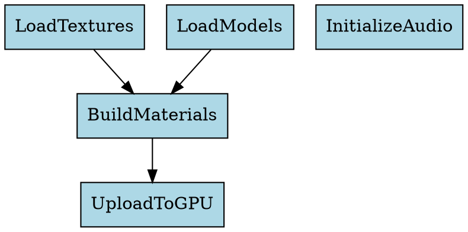

# DAG Visualizer Tool

Command-line utility that exports `FrameScheduler` task dependency graphs to Graphviz DOT format, enabling visual analysis of execution order and bottlenecks.

## Building

The tool is included when `SOULLIB_BUILD_TOOLS=ON` (enabled by default):

```powershell
cmake -S . -B build -DCMAKE_BUILD_TYPE=Debug
cmake --build build --config Debug
```

Executable: `build/bin/Debug/SoulLibDagViz.exe`

## Usage

```powershell
& "build/bin/Debug/SoulLibDagViz.exe" output.dot
```

The tool runs a sample `FrameScheduler` scenario with interdependent tasks (texture loading, model loading, material building, GPU upload, audio init) and exports the dependency DAG to the specified file.

Render the DOT file with Graphviz:

```bash
dot -Tpng output.dot -o dag.png
```

## Integration

Production integrations should extend `FrameScheduler` to expose a snapshot API (`capture_dag()`) that returns task metadata without executing the workloads. The visualizer can then consume these snapshots for offline analysis or live dashboards.

## Example Output



Visual output shows parallel loading paths converging at `BuildMaterials`, then feeding `UploadToGPU`, while `InitializeAudio` runs independently.
